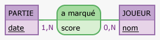
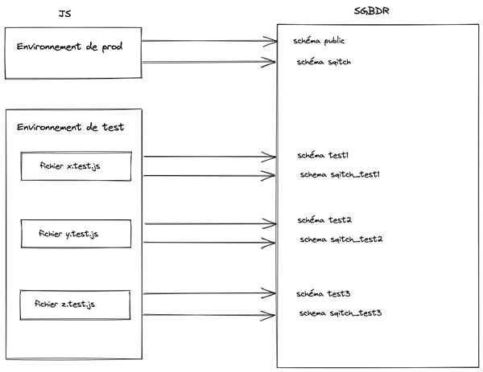

# Pong

Version JavaScript de l'un des tout premiers jeux vidéo  
Il s'agit d'un ping-pong virtuel en 11 points

# Serveur

## Stack technique

[PostgreSQL](https://www.postgresql.org/)  
[Sqitch](https://sqitch.org/)  
[Redis](https://redis.io/)  
[NodeJs](https://nodejs.org/fr/)

Tous ces éléments doivent être installé sur l'hôte pour faire fonctionner l'API

## Installation

Cloner le projet et se positionner dans son répertoire

### BDD

Création de l'utilisateur et de la base de données du projet

```bash
psql -U <superuser>
```

```sql
CREATE USER <username> WITH PASSWORD '<password>';
CREATE DATABASE pong OWNER <username>
```

### Seeding

Des données de test sont disponibles dans le dossier server/data  
Pour les utiliser :

```bash
psql -U <username> -d pong -f <chemin/vers/server/data/seed.sql>
```

### Fichiers de configuration

Copier le fichier sqitch.example.conf en le renommant en sqitch.conf

Copier le fichier .env.example en le renommant en .env

Compléter ce fichier avec les informations de connexion à la BDD et le port de l'application express

### Déploiement de la structure de la BDD

La base de données respecte le MCD suivant :



Pour déployer la structure, se positionner dans le dossier `server` et lancer la commande

```bash
sqitch deploy
```

### Récupération des dépendances

Depuis le dossier `server`, lancer la commande

```bash
npm install
```

### Lancement du serveur

- serveur de développemnt : 

```bash
npm run dev
```

- serveur de production

```bash
npm start
```

## Documentation de l'API

Générée selon le standard [OpenAPI](https://swagger.io/specification/) avec [express-jsdoc-swagger](https://brikev.github.io/express-jsdoc-swagger-docs/#/)

Disponible sur l'url `http://host:port/api-docs`

## Tests unitaires

Réalisés avec [Jest](https://jestjs.io/fr/) et [Supertest](https://github.com/visionmedia/supertest)  

Jest lance tous les tests de façon concurrente  
Afin d'éviter de manipuler la base de prod et d'avoir des accès concurrents aux mêmes data, on utilise l'architecture suivante :



Pour exécuter les tests, depuis le dossier `server`, lancer la commande :

```bash
npm test
```
