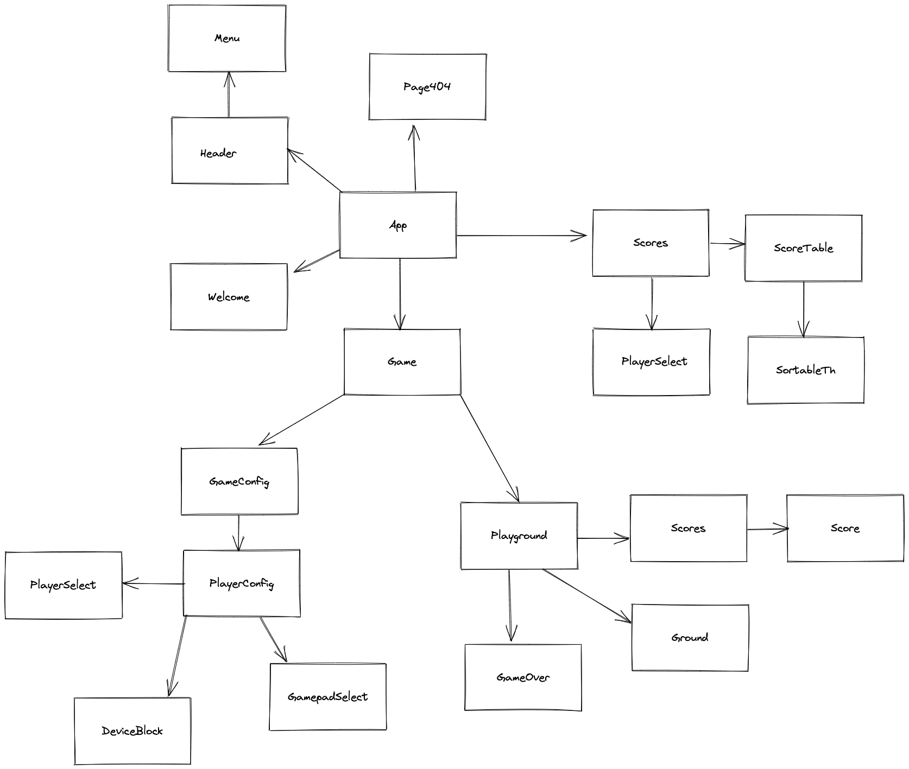

# Pong

Version JavaScript de l'un des tout premiers jeux vidéo  
Il s'agit d'un ping-pong virtuel en 11 points

# Serveur

## Stack technique

[PostgreSQL](https://www.postgresql.org/)  >= v12
[Sqitch](https://sqitch.org/)  latest
[Redis](https://redis.io/)  latest
[NodeJs](https://nodejs.org/fr/) >= v12

Tous ces éléments doivent être installé sur l'hôte pour faire fonctionner l'API

## Installation

Cloner le projet et se positionner dans son répertoire

### BDD

Création de l'utilisateur et de la base de données du projet

```bash
psql -U <superuser>
```

```sql
CREATE USER <username> WITH PASSWORD '<password>';
CREATE DATABASE pong OWNER <username>
```

### Fichiers de configuration

Se positionner dans le dossier `server`

Copier le fichier sqitch.example.conf en le renommant en sqitch.conf

Copier le fichier .env.example en le renommant en .env

Compléter ce fichier avec les informations de connexion à la BDD, au cache Redis et le port de l'application express

### Déploiement de la structure de la BDD

La base de données respecte le MCD suivant :


Pour déployer la structure, se positionner dans le dossier `server` et lancer la commande

```bash
PGUSER=<username> PGPASSWORD=<password> sqitch deploy
```

### Seeding

Des données de test sont disponibles dans le dossier server/data  
Pour les utiliser :

```bash
psql -U <username> -d pong -f <chemin/vers/server/data/seed.sql>
```

### Récupération des dépendances

Depuis le dossier `server`, lancer la commande

```bash
npm install
```

### Lancement du serveur

- serveur de développemnt : 

```bash
npm run dev
```

- serveur de production

```bash
npm start
```

## Documentation de l'API

Générée selon le standard [OpenAPI](https://swagger.io/specification/) avec [express-jsdoc-swagger](https://brikev.github.io/express-jsdoc-swagger-docs/#/)

Disponible sur l'url `http://host:port/api-docs`

## Tests unitaires

Réalisés avec [Jest](https://jestjs.io/fr/) et [Supertest](https://github.com/visionmedia/supertest)  

Jest lance tous les tests de façon concurrente  
Afin d'éviter de manipuler la base de prod et d'avoir des accès concurrents aux mêmes data, on utilise l'architecture suivante :


Pour exécuter les tests, depuis le dossier `server`, lancer la commande :

```bash
npm test
```

## Cache Redis

Afin d'accélérer la récupération des informations, chaque résultat d'une requête SQL est placé dans le cache Redis pour une durée de 30 minutes

Ce délai garantit qu'aucune information devenue inutile ne persitera dans le cache

Les entrées en cache seront automatiquement supprimées à chaque ajout d'un nouveau score en BDD afin de déclencher une nouvelle requête SQL pour obtenir la liste des scores mise à jour

# Client

Réalisé avec react 17

## Installation

Se positionner dans le dossier `client`

### Fichiers de configuration

Copier le fichier .env.example en le renommant en .env

Compléter ce fichier avec les informations de connexion à la BDD, au cache Redis et le port de l'application express

### Récupération des dépendances

Depuis le dossier `server`, lancer la commande

```bash
npm install
```

## Développement

### Lancement de la version développement

```bash
npm start
```

## Production

### Création de la version optimisée de production

```bash
npm run build
```

### Copie des fichiers optimisés dans le dossier des ressources statiques

Depius le dossier `client`, lancer la commande :

```bash
cp -R ./build/* ../server/public
```

## Composants de l'application



## Custom hooks

- useAutoscroll : permet de scroller automatiquement en bas de page lors de la configuration du jeu
- useBallLoop : gestion de la boucle d'animation du jeu
- useDevices : configure l'EventListener du clavier ou les fonctions d'animation des gamepads
- useFetch : effectue les requête en GET vers l'API
- useGamepad : gestion des événements de détection des gamepads
- useLoop : boucle d'animation globale
- useResize : gestion du comportement du "terrain de jeu" lors du redimensionnement de la fenêtre
- useSort : gestion de la logique de tri des éléments du tableau des scores
- useTitle : Mise à jour du titre de l'onglet
